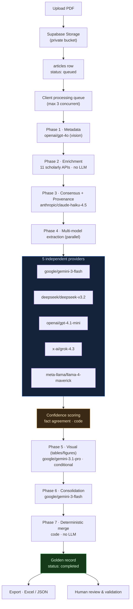

# Infinity Research

**Automated, reproducible structured extraction from scientific PDFs — with multi-model consensus and full provenance.**

Infinity Research turns a folder of research-paper PDFs into a **validated, structured dataset** you can export to Excel or JSON. Upload a PDF and a 7-phase pipeline extracts its bibliographic metadata, methodology, populations, interventions and **quantitative outcomes ready for meta-analysis** — cross-checking everything against 11 scholarly APIs and several independent LLMs so you know *how much to trust each field*.

It is built for **systematic reviews, meta-analyses and evidence synthesis**, where reliability and traceability matter more than raw speed.

It is **BYOK (Bring Your Own Key)** and **self-hosted**: you run your own instance with your own [OpenRouter](https://openrouter.ai) API key, so you pay the model providers directly and your PDFs never pass through anyone else's server.

> [!WARNING]
> Infinity Research is a research **aid**, not a source of truth. LLM extraction can be wrong. Every extracted record should be checked by a human before use in a publication — that is exactly what the built-in review system is for.

---

## Table of contents
- [Why it's different](#why-its-different)
- [How it works (architecture)](#how-it-works-architecture)
- [The pipeline, phase by phase](#the-pipeline-phase-by-phase)
- [Confidence scoring & provenance](#confidence-scoring--provenance)
- [Tech stack](#tech-stack)
- [Quickstart (self-hosted)](#quickstart-self-hosted)
- [Cost](#cost)
- [Exports](#exports)
- [Security model](#security-model)
- [Known limitations](#known-limitations)
- [Contributing · Citing · License](#contributing)

---

## Why it's different

Most "chat with your PDF" tools do **single-model** extraction and give you no way to gauge trust. Infinity Research is built around three ideas:

1. **Multi-model consensus.** The core scientific extraction runs **five independent models from five different providers in parallel** (Google, DeepSeek, OpenAI, xAI, Meta). A programmatic confidence score then measures how much the models *agree on the actual facts* — percentages, p-values, confidence intervals, sample sizes, AUC/accuracy. Disagreement is surfaced, not hidden.
2. **Provenance.** Bibliographic metadata is cross-checked against **11 public scholarly APIs**, and the final record documents *where each field came from* (`vision | crossref | openalex`) and which conflicting sources were rejected and why.
3. **Meta-analysis-ready output.** Beyond prose summaries, the pipeline extracts **structured outcomes** (arms, n, mean/SD, events/total, effect sizes, CIs, p-values) as rows you can drop into a meta-analysis.

The result is a **"golden record" per article** with a documented, auditable trail — the kind of reproducibility a systematic review needs.

---

## How it works (architecture)



Everything for one article lives in a single `articles` row in Postgres; each phase writes its own JSON output (`phase1_json … phase7_json`) plus per-phase cost, tokens and duration. Row Level Security scopes every row to its owner, and Supabase Realtime streams live progress to the UI.

---

## The pipeline, phase by phase

| # | Phase | Model(s) | Input | Output |
|--:|-------|----------|-------|--------|
| 1 | **Metadata extraction** | `openai/gpt-4o` | PDF | title, authors, DOI, abstract, journal, year, keywords, **study type**, has_tables/figures, funding, conflicts, registration № |
| 2 | **Bibliographic enrichment** | — (11 HTTP APIs, parallel) | title/DOI | raw records from each API + per-API success + which fields each contributed |
| 3 | **Consensus + provenance** | `anthropic/claude-haiku-4.5` | P1 + P2 (text) | golden metadata record with `field_sources`, `conflicts_resolved`, `rejected_sources` |
| 4 | **Multi-model extraction** | `google/gemini-3-flash-preview` · `deepseek/deepseek-v3.2` · `openai/gpt-4.1-mini` · `x-ai/grok-4.3` · `meta-llama/llama-4-maverick` | PDF | 5 independent extractions: methodology, population, intervention/control, primary/secondary outcomes, limitations, conclusions, **structured outcomes** |
| – | **Confidence scoring** | — (deterministic code) | P4 | per-field agreement score based on matching quantitative facts across the 4 models |
| 5 | **Visual extraction** *(only if tables/figures exist)* | `google/gemini-3.1-pro-preview` | PDF | actual data values from figures & tables |
| 6 | **Scientific consolidation** | `google/gemini-3-flash-preview` | P4 + P5 (text) | single consolidated record + per-field agreement notes |
| 7 | **Final merge** | — (deterministic code) | P3 + P6 + confidence | the golden record; marks the article `completed` |

**Phase 2 — the 11 APIs:** PubMed · OpenAlex · Crossref · Semantic Scholar · Europe PMC · arXiv · DataCite · Unpaywall · DOAJ · ORCID · CORE. Nine work with **no key at all**; Semantic Scholar, OpenAlex and CORE optionally take a key (in Settings) to raise rate limits / coverage.

> The models above are the single, fixed production pipeline. You can change them in [`src/lib/processing/models.ts`](src/lib/processing/models.ts) (`PIPELINE_CONFIG`).

---

## Confidence scoring & provenance

- **Fact-based agreement** — after Phase 4, regexes pull quantitative facts (`%`, `p<0.05`, `95% CI`, `n=…`, `AUC/accuracy/sensitivity`) from each of the 5 model outputs and compute, per field, how many models report the same facts. This is a *measurement of inter-model agreement*, not a model's self-reported confidence.
- **Provenance** — Phase 3 records, for every metadata field, which sources confirmed it (e.g. `"doi": "vision|crossref|openalex"`), the conflicts it resolved (chosen value + reason), and the sources it rejected (with reason). This is what makes the output auditable for a systematic review.

---

## Tech stack

Next.js 16 (App Router, React 19) · Supabase (Postgres 17, Auth, Storage, Realtime) · Tailwind CSS 4 · Recharts · ExcelJS · OpenRouter (LLM gateway) · deployable on Vercel.

---

## Quickstart (self-hosted)

Everything below uses free tiers **except the LLM calls**, which you pay for via your own OpenRouter key.

### 1. Prerequisites
- **Node.js 20.6+** and npm
- A free **[Supabase](https://supabase.com)** project
- An **[OpenRouter API key](https://openrouter.ai/keys)**

### 2. Clone & install
```bash
git clone <YOUR_REPO_URL> infinity-research
cd infinity-research
npm install
```

### 3. Set up the database
In the Supabase dashboard → **SQL Editor**, paste and run the whole file:
```
supabase/schema/setup.sql
```
It creates every table, RLS policy, trigger, function, the private `article-pdfs` storage bucket and the realtime publications. It is **idempotent** (safe to re-run).

### 4. Configure environment
```bash
cp .env.example .env.local
```
Fill in (Supabase → Project Settings → API):

| Variable | Where to get it |
|---|---|
| `NEXT_PUBLIC_SUPABASE_URL` | Project URL |
| `NEXT_PUBLIC_SUPABASE_ANON_KEY` | anon / publishable key |
| `SUPABASE_SERVICE_ROLE_KEY` | service_role / secret key — **server-only** |
| `OWNER_EMAIL` / `OWNER_PASSWORD` | any values — the auto-created owner account (see [Security model](#security-model)) |

### 5. Run
```bash
npm run dev
```
Open **http://localhost:3000** — **there is no login screen**. This is a single-user, self-hosted app: the first visit automatically signs you in as the owner. Then:

1. Go to **Settings** → paste your **OpenRouter API key** → *Test* → *Save*.
2. **Upload** one or more PDFs.
3. Click **Start** on the dashboard and watch the 7 phases run (Realtime).
4. **Preview / Export** to Excel or JSON, and use the **review** panel to validate.

### 6. Deploy (optional)
Deploy to **[Vercel](https://vercel.com)** with the same environment variables. Read the [Security model](#security-model) first if it will be reachable by anyone but you.

---

## Cost

You pay OpenRouter per token — **typically ~$0.15–0.25 per article** (varies with PDF length and whether the visual phase runs). The app tracks the **actual reported cost per phase and per article** and shows it in the dashboard, the metrics page and the Excel export, so you always know what you spent. Phase 2 (the 11 APIs) is free.

---

## Exports

- **Excel (`.xlsx`)** — 3 sheets: *Scientific Data* (metadata + extraction), *Visual & Costs* (per-phase model + cost), *Performance* (per-phase duration & tokens).
- **JSON** — the full golden record for every selected article.

---

## Security model

This is a **single-user** app by design: there is **no login**. A middleware (`src/proxy.ts`) automatically signs in one owner account (from `OWNER_EMAIL` / `OWNER_PASSWORD`, created on first run), so Row Level Security still applies normally under the hood.

> [!IMPORTANT]
> Because there is no login, **access control is entirely network-level — anyone who can reach the app is the owner.** Run it on localhost or a private network you control. If you expose it publicly, put your own authentication/reverse-proxy in front of it. Treat `SUPABASE_SERVICE_ROLE_KEY` as a master secret and never commit `.env.local`.

---

## Known limitations

Shared honestly, in the spirit of a research tool:

- The processing queue is **client-side** — if you close the browser tab mid-run, processing stops (it resumes on next Start).
- BYOK API keys are stored in **your own** Supabase DB under RLS, but **not encrypted at rest** at the app layer.
- **No automated test suite** yet.
- **Model availability drifts** — provider model IDs get deprecated over time and may need updating in `models.ts`. Phase 4 is resilient: if one of the four models fails, the others still produce a result.

Contributions that address these are very welcome.

---

## Contributing

See [`CONTRIBUTING.md`](CONTRIBUTING.md). In short: never commit secrets, use a throwaway Supabase project for dev, keep `supabase/schema/setup.sql` in sync with schema changes, and run `npm run lint` before a PR.

## Citing

If Infinity Research helps your research, please cite it — see [`CITATION.cff`](CITATION.cff).

## License

[GNU AGPL-3.0](LICENSE). You're free to use, modify and self-host it; if you offer it to others over a network, you must release your modified source under the same license.
